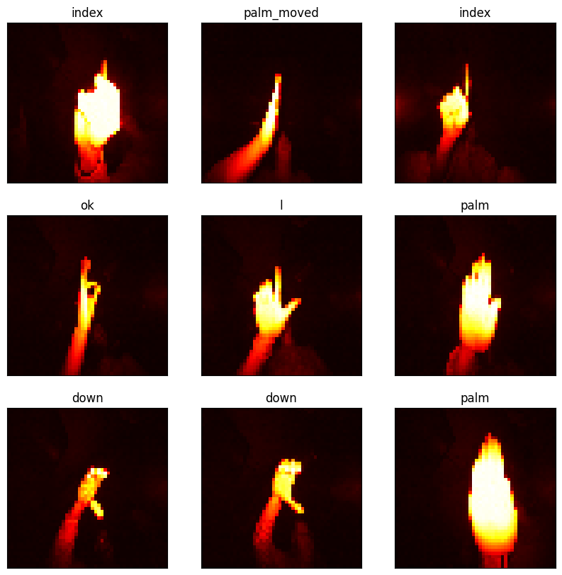
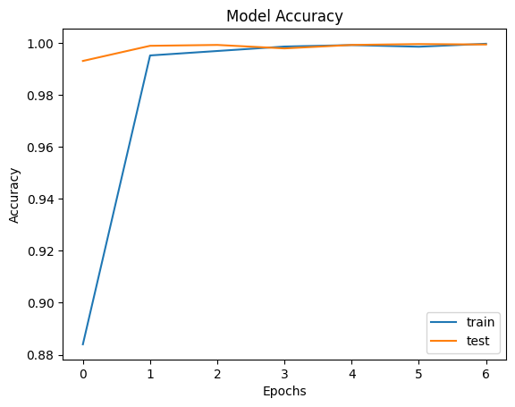
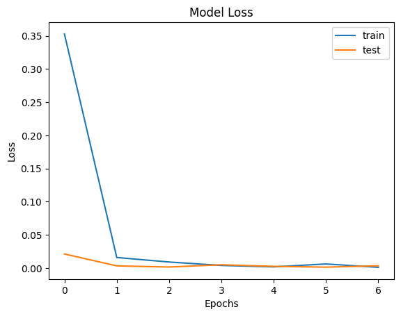

# PRODIGY_ML_04
✋🤚 Hand Gesture Recognition Using Convolutional Neural Networks (CNN)

This project was completed as part of the **Machine Learning Internship at Prodigy InfoTech**.  
The aim is to develop a **Hand Gesture Recognition model** that can accurately identify and classify different hand gestures from image data, enabling intuitive **Human-Computer Interaction** and gesture-based control systems.

---

## 📌 Objective
Classify hand gesture images into predefined categories using:
- Image Preprocessing (Resizing & Normalization)
- One-Hot Encoding
- CNN Model Training & Testing
- Model Evaluation & Visualization

This project demonstrates how deep learning can be applied in **Computer Vision** for gesture-based recognition tasks.

---

## 🧾 Dataset
- 📂 **Dataset Name**: [LeapGestRecog](https://www.kaggle.com/gti-upm/leapgestrecog)  
- 📊 **Structure**:
- leapGestRecog/
- ├── 00/
- │ ├── 01/
- │ ├── 02/
- │ ├──....
- ├── 01/
- |.....
Each folder represents a subject, and inside are gesture categories with multiple samples.

---

## 🧠 Key Concepts
- **CNN (Convolutional Neural Network):** Deep learning model designed for image classification.
- **Image Preprocessing:** Grayscale conversion, resizing to (50x50), and normalization.
- **One-Hot Encoding:** Transform labels into binary class matrices for multi-class classification.
- **Model Evaluation:** Accuracy, confusion matrix, and classification report.

---

## 💻 Technologies Used
| Tool/Library   | Purpose |
|----------------|---------|
| Python         | Programming Language |
| NumPy          | Numerical Operations |
| Matplotlib     | Data Visualization |
| OpenCV         | Image Processing |
| TensorFlow/Keras | Deep Learning Model |
| Scikit-learn   | Preprocessing & Evaluation |

---

## 📊 Steps Followed
1. **Data Loading**
 - Read gesture images from dataset folders.
 - Converted to grayscale & resized to (50, 50).

2. **Preprocessing**
 - Normalized pixel values.
 - Converted labels into one-hot encoded vectors.

3. **Splitting Data**
 - Train-test split (80:20 ratio).

4. **Model Training**
 - Built CNN with Conv2D, MaxPooling, Flatten, Dense layers.
 - Trained with categorical crossentropy loss & Adam optimizer.

5. **Evaluation**
 - Checked accuracy & loss on test set.
 - Generated confusion matrix.

6. **Visualization**
 - Training vs Validation Accuracy/Loss plots.
 - Sample gesture predictions.

---

## 🔗 Open in Google Colab

---

## 📈 Training History
- Training Accuracy improved steadily and converged after ~7 epochs.
- Validation Accuracy ~99% achieved on test set.

---

## 📸 Sample Predictions
  
✔️ Predicted labels matched hand gesture categories with high confidence.

---

## 📈 Graph between "Epochs" vs "Accuracy"
 

---

## 📈 Graph between "Epochs" vs "LOSS"
 

---

## 🔍 Insights Gained
- CNNs perform exceptionally well on gesture classification tasks.
- Proper preprocessing (resizing, normalization) boosts model performance.
- Balanced dataset helps reduce bias in gesture predictions.
- Could be extended to **real-time gesture recognition** with OpenCV.

---

## 🚀 Future Work
- Real-time recognition using webcam input.
- Transfer Learning with pretrained CNNs for better accuracy.
- Deploy model into a mobile app or web application.

---
